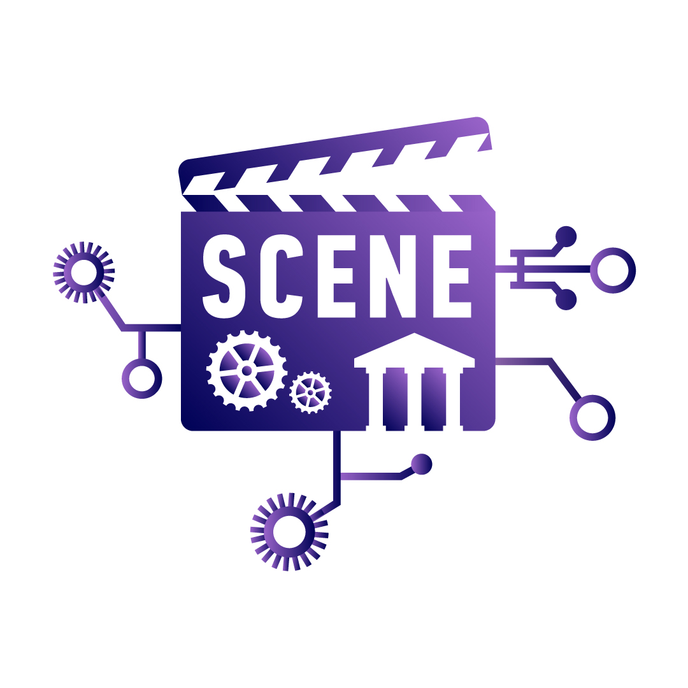

# SCENE Ontology Documentation Page 

This documentation explores in detail the SCENE Ontology Tools as one of the main components of the SCENE architecture. To access the SCENE project website, click [here](https://thesceneproject.eu/).

> **SCENE aims at building a globally competitive European film industry through AI and cultural heritage.**

SCENE is a European Horizon Europe research project that aims to offer the means for a modern and globally competitive, European filmmaking industry, by building upon two solid pillars, i.e. semantically cognitive AI technologies and the (in)tangible European Cultural assets, always with respect to the European values & policies regarding the human and its environment.

SCENE has been financed by the **HE culture, creativity and inclusive society programme** under Grant Agreement No 101095303.  

  
